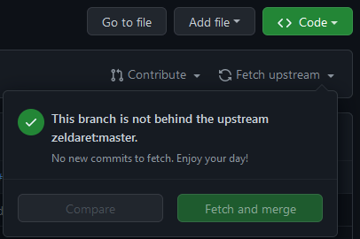
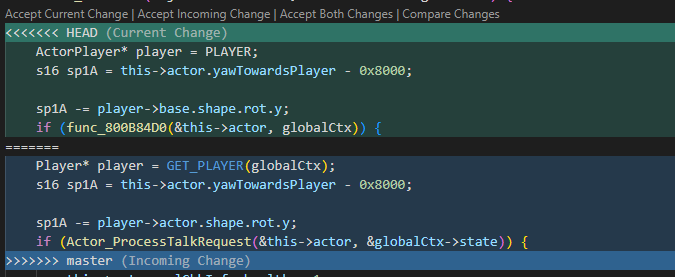

# Useful Tips and Tricks With Git

Git is the distributed version control system of choice for this project. It will be the main way you will be able to get the latest updates to the project and contribute your own if you so choose.

When it comes to Git, there are different ways that you can do commands: command line or a Graphical User Interface(GUI). The GUI that will be used is within VS Code, or on the web browser. Where possible, both styles will be shown.

## Making a New Branch

When developing in a large project such as this one, it is a good idea to use branches. Branches in git are a pointer to a snapshot of your changes. When you want to add in a new actor or even make your own custome changes, you will want to make a new branch. This makes it harder for unstable code to get merged into the main code, it also provides the ability to clean up your own code before merging it into the main branch.

To create a new branch on the command line there are a couple of different ways:

- The first way is to first create a branch

  ```bash
  git branch <branch-name>
  ```

  The previous command has made the new branch, but you are still on master. To navigate to the new branch you will need to "checkout" the branch by entering

  ```bash
  git checkout <branch-name>
  ```

- An alternative way to checkout to a new branch is by the following command:

    ```bash
    git checkout -b <branch-name>
    ```

    This will create a new branch from whatever branch you were on

<mark>IMPORTANT</mark> - When making new branches it is recommended to do this from the master/main branch

## Remote Repositories

When you fork a repository you created your own copy of the code base. If you want to contribute or pull in any updates to the codebase, you will need to add a remote repository.

To add a new upstream repository that will be synced with your fork:

```bash
git remote add upstream https://github.com/zeldaret/mm.git
```

## Merging and Rebasing

If you have a remote repository setup, you can pull and merge in updates to the repository. In this project we use merging as to preserve the history of the repository, so the focus will be on how to merge instead of rebasing.

1. Syncing a fork from command line

    From your terminal navigate to the repository and make sure you are in the master branch then run

    ```bash
    git fetch upstream
    ```

    this will fetch all the upstream changes. To merge them in run

    ```bash
    git merge upstream/master
    ```

    To complete the merge all you need to do is push the changes with a simple

    ```bash
    git push
    ```

2. Syncing from the Web UI

    - On GitHub, navigate to the main page of the forked repository that you want to sync with the upstream repository.
    - Select the Fetch upstream drop-down.
    - Review the details about the commits from the upstream repository, then click Fetch and merge

    

    If the changes from the upstream repository cause conflicts, GitHub will prompt you to create a pull request to resolve the conflicts. This can be done in VS Code or the command line.

With the master/main branch up to date, the other branches are able to get the changes by a simple merge. Navigate to the branch that will be updated and run the merge command.

```bash
$ git checkout <branch-name>

Switched to branch <branch-name>

$ git merge master
```

### Resolving Merge Conflicts

Merge conflicts are bound to happen at some point. When merging you will be notified if there are any conflicts. To resolve them, open the files that have conflicts and the sections will have indications of where the conflicts are. In VS Code, the conflict areas will appear in highlighted sections



Inspect the differences and choose to Accept the current change (Typically what you currently have), accept the incoming change from the merge, or accept both changes. Once that is done save the file and add it to the merge commit.

If you prefer the command line, you can run

```bash
git status
```

to get a list of all the files with a conflict. With those results, to see what the differences are in the files you can run:

```bash
git diff <file-path>
```

You will need to open the conflicted file in a text editor (Vim/emacs/vscode) to fix the file.

If things get too complicated there is always the emergency parachute to pull and abort the entire merge process:

```bash
git merge --abort
```

Executing this command will exit from the merge process and return the branch to the state before the merge began.

## Stashing Changes For Later

Suppose you needed to check something out on master, or merge in some changes but weren't quite ready to commit your changes. One thing that you can do is stash your changes and come back to them later. To stash your changes use

```bash
$ git stash
Saved working directory and index state WIP on <branch-name>
```

To retrieve your stashed changes enter

```bash
git stash pop
```

As a note, stashing changes functions as a stack, first in last out (FILO), so you can stash multiple times but when you pop off a change it will be the previously stashed item.
