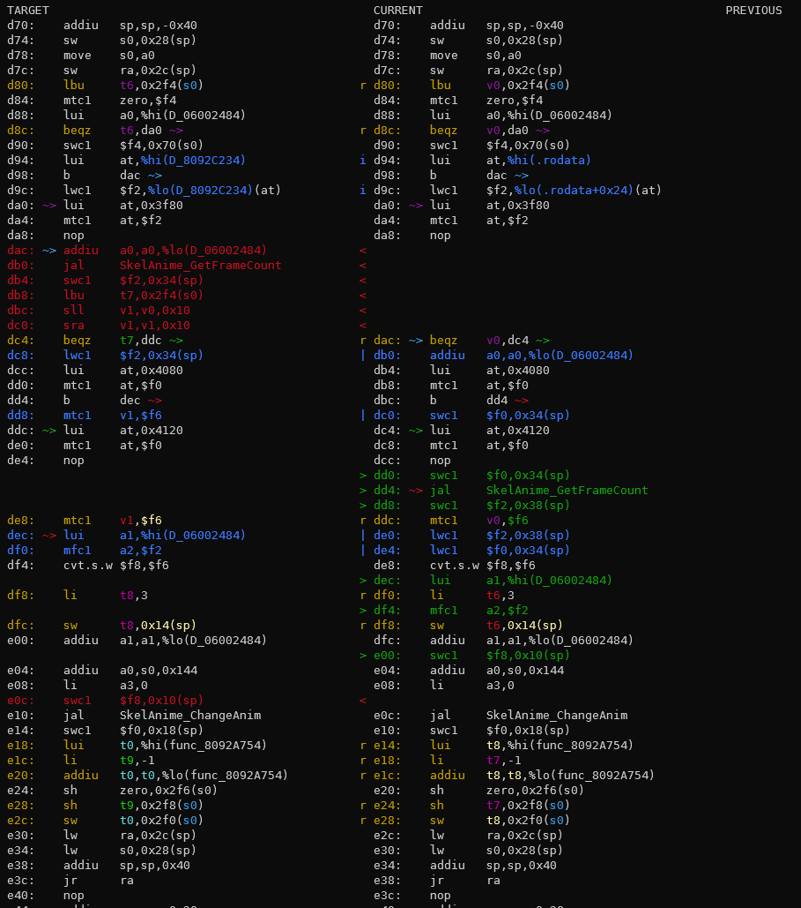
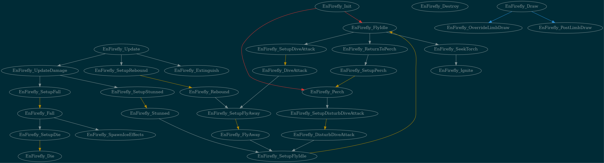

# Table of Contnets

- [Table of Contnets](#table-of-contnets)
  - [Introduction](#introduction)
  - [In the repository](#in-the-repository)
    - [`diff.py`](#diffpy)
    - [`tools/m2ctx.py`](#toolsm2ctxpy)
    - [`tools/overlayhelpers/actor_symbols.py`](#toolsoverlayhelpersactor_symbolspy)
    - [`first_diff.py`](#first_diffpy)
    - [`sym_info.py`](#sym_infopy)
    - [`extract_assets.py`](#extract_assetspy)
    - [`tools/assist.py`](#toolsassistpy)
    - [`tools/get_actor_sizes.py`](#toolsget_actor_sizespy)
    - [`tools/progress.py`](#toolsprogresspy)
    - [`tools/regconvert.py`](#toolsregconvertpy)
    - [`tools/rename_global_asm.py`](#toolsrename_global_asmpy)
    - [`tools/rename_sym.sh`](#toolsrename_symsh)
    - [`tools/actorfixer.py`](#toolsactorfixerpy)
    - [`tools/timeconv.py`](#toolstimeconvpy)
    - [`tools/sfx_convert.py`](#toolssfx_convertpy)
    - [`tools/vt_fmt.py`](#toolsvt_fmtpy)
    - [`tools/graphovl.py`](#toolsgraphovlpy)
    - [`tools/warnings_count/check_new_warnings.sh`](#toolswarnings_countcheck_new_warningssh)
    - [`tools/warnings_count/update_current_warnings.sh`](#toolswarnings_countupdate_current_warningssh)
    - [`fixle.sh`](#fixlesh)
    - [`format.py`](#formatpy)
  - [External tools](#external-tools)
    - [mips_to_c](#mips_to_c)
    - [Permuter](#permuter)
    - [vbindiff](#vbindiff)
    - [Texture64](#texture64)
    - [Z64Utils](#z64utils)
  - [Retired tools](#retired-tools)
    - [`tools/overlayhelpers/ichaindis.py`](#toolsoverlayhelpersichaindispy)
    - [`tools/overlayhelpers/colliderinit.py`](#toolsoverlayhelperscolliderinitpy)
    - [`tools/overlayhelpers/colchkinfoinit.py`](#toolsoverlayhelperscolchkinfoinitpy)
    - [`tools/overlayhelpers/damage_table.py`](#toolsoverlayhelpersdamage_tablepy)
    - [`tools/vtxdis`](#toolsvtxdis)
    - [Reservation Tracking](#reservation-tracking)

## Introduction

There are a variety of tools that are used to assist in the decompilation process. This guide is an introduction to some of the tools that are used. Most of these tools are located in the `mm/tools` directory, others are either in the project root, or are separate programs entirely. Almost all of these programs have more information available via running them with `-h`.

## In the repository

### `diff.py`

Your best friend for most of the decompilation work. Compares the original assembly extracted from the ROM instruction-for-instruction with what the code you have written compiles to.

To use `diff.py`, you need a copy of a matching build folder to diff against. In MM, this can be made with `make diff-init`, which will rebuild both ROMs, check for OK, and copy the build folder and the roms.

`diff.py` takes the function symbol name as the main argument:

```bash
./diff.py <flags> ObjTree_Init
```

`diff.py` reads the respective `mm.map` files to find the function. If the function has been renamed, it will not be able to find it. You should not edit map files yourself, but instead rerun `make diff-init` (it is possible to copy the build folder manually, but it's better not to, since `make diff-init` guarantees an OK `expected` folder).

The recommended flags used are `-mwo`, `-mwo3`, or `-mwob`:

- `-m` ("make") builds the file used for diffing automatically when `diff.py` is run.
- `-w` ("watch") will watch the C file containing the function (and only the C file!) and automatically recompile when it changes.
- `-o` ("object file") uses only the `.o` file. This is faster than without, and means you can see symbol names, but obscures the data behind relative addresses: if you have differences in the .text section that are invisible with `-o`, or you suspect the data is shifted in some way, try without
- `-3` creates a three-way diff: TARGET/CURRENT/PREVIOUS, which is particularly useful for seeing changes.
- `-b` creates a three-way diff: TARGET/CURRENT/BASE, where BASE is the version from when the program was started.
- `-s` ("stop") stops diffing at the next `jr $ra`, commonly the end of the function. Beware that some functions with conditionals may have multiple `jr $ra`s, so this feature can chop the bottom off the diff.

There are numerous other options that are not used as often (changing the diffing algorithm, viewing the source code in the diff, ...), and the various flags have dependencies among themselves, so check its documentation with `-h` to get fuller information.

Colour explanations (sadly GitHub markdown does not allow for fancy colouring here):

- white/grey is matching instructions
- red is missing instructions
- green is extra instructions
- blue means something in the instruction is wrong, be it numerical differences in the immediates, or the whole thing. Not all blue is meaningful: using `-o` to get symbols, the addresses of imported data will be blue since the relative address looks different from the absolute one.
- yellow means the instruction itself is correct, but the registers used are not (*regalloc*, register allocation)
- Each register gets its own colour when the regalloc is wrong, which makes it much easier to follow their usage.
- a branch is indicated by coloured `~>`s on the right of the instruction, and their targets by the same colour `~>` on the left of the instruction (remember delay slots!). The colours matching is a good indication that the branches are correct, although not infallible, since there are only so many colours it will use.
- occasionally instructions will be coloured a <span style="color:#767676; font-weight: bold; background-color:#0C0C0C; padding: .2rem">dark grey</span>. You should consider this the same as blue.

Example Diff:



### `tools/m2ctx.py`

Pass it the path to a C file to generate the context for that C file, to help [mips_to_c](#mips_to_c). Writes to a file called `ctx.c` in the root directory of the repo.

### `tools/overlayhelpers/actor_symbols.py`

Takes a VRAM or VROM address to get overlay file and offset for an Actor.

### `first_diff.py`

Gives you the addresses of first difference in the ROM, the difference, and a count of how many bytes differ, or if the whole ROM is shifted.

### `sym_info.py`

Can be given a symbol (function or variable name, for example), and will find its ROM, VRAM, and file using the map file. E.g.

```bash
$ ./sym_info.py ObjTree_Init
Symbol ObjTree_Init (RAM: 0x80B9A0B0, ROM: 0xFFF210, build/src/overlays/actors/ovl_Obj_Tree/z_obj_tree.o)
```

### `extract_assets.py`

A tool that will use ZAPD to extract assets from the baserom.

### `tools/assist.py`

Searches for similar functions to the one you are passing, and it tells you which one are decompiled. You can pass the name of an overlay and it will search for similar functions for every function in said overlay.

(Still a little broken)

### `tools/get_actor_sizes.py`

Generates a list of actors with various statistics about their function sizes. Run with `-h` for information on flags.

(nonmatching does not work currently: we need to adapt it to MM's assembly files)

### `tools/progress.py`

Gives the progress output that the website uses. Run for that warm glow.

### `tools/regconvert.py`

Convert `mips2c`'s `gRegEditor->data[n]` output (or a raw offset) into the appropriate variable in the REG pages. Can also be run on a file to mass-convert them: run with `-h` for details.

### `tools/rename_global_asm.py`

Will rename the single-function assembly files in `asm/non_matchings` when the function they contain has been renamed. Should mean you have to run `make disasm` far less frequently.

### `tools/rename_sym.sh`

Will rename a symbol throughout the codebase. **Be very careful with this script**: it has no sanity checks, so you can do a lot of damage if you're not careful. Best to commit before using it.

### `tools/actorfixer.py`

Provided it is kept up-to-date with function renames, you can run this to automatically update your branch with the new names. `.` will cause it to replace in the whole repo, or you can pass it a specific file path to run it on only that file.

### `tools/timeconv.py`

Changes a raw `u16` value into a macro for clock time in-game:

```bash
$ ./tools/timeconv.py 0x4800
6,45 -> 0x4800
CLOCK_TIME(6, 45)
```

Either dec or hex input will work. It will warn if the macro output will not match:

```bash
$ ./tools/timeconv.py 44102
16,09 -> 0xAC44
CLOCK_TIME(16, 9)
Warning: Result does not match as-is
```

### `tools/sfx_convert.py`

Replaces sfx ids by their corresponding defines from `sfx.h`. Run on a single file to replace all of them.

### `tools/vt_fmt.py`

Replaces VT symbols by their corresponding macros. Not many files in MM need this; ask if you need help with it.

### `tools/graphovl.py`

Creates a graph of action functions (black and green arrows) and function calls (blue arrows) for a given overlay file. For best results, run this from the root directory

Example: `./tools/graphovl/graphovl.py En_Firefly`

This will save a `.png` of the overlay in the `/graphs` directory.

See Example below.



### `tools/warnings_count/check_new_warnings.sh`

Runs a make from clean and checks if new warnings have been produced: we use Jenkins to check this as well, but you should run this before opening a PR.

You can specify how many threads you would like this to run with by adding the `-jN` flag. Where N is the number of threads. By default this will run using 1 thread (i.e. `-j1`).

Run `check_new_warnings.sh -h` for more information.

### `tools/warnings_count/update_current_warnings.sh`

If you have to add new warnings, **and have permission from the leads**, run this to update the file used for warnings comparison.

### `fixle.sh`

Fixes line endings in the repo to Linux style (LF), which is required for the build process to work. (You may be better off creating a new clone directly in Linux/WSL, though)

### `format.py`

Formats all C files in the repo using `clang-format-14`, `clang-tidy`, and `clang-apply-replacements` (when multiprocessing). This will touch all files in the repo, so the next `make` will take longer.

You can specify how many threads you would like this to run with by adding the `-jN` flag. Where N is the number of threads. By default this will run using 1 thread (i.e. `-j1`).

`clang-14` is available in many native package managers, but if not try:

Linux:
Download llvm's setup script, run it, than install normally
```bash
wget https://apt.llvm.org/llvm.sh
chmod +x llvm.sh
sudo ./llvm.sh 14
rm llvm.sh
sudo apt install clang-format-14 clang-tidy-14 clang-apply-replacements-14
```

Mac:
Brew does not have clang-format-14, but MacPorts does.

(Have been unable to confirm actual commands with somone that has a Mac)


## External tools

### mips_to_c

mips_to_c (or mips2c) is a tool that takes MIPS assembly and will attempt to convert it to C.

There are different ways you can run mips2c:

- Clone the repo and run it loclly on your own machine. Follow set up instructions at <https://github.com/matt-kempster/mips_to_c>
- An online version is available at <https://simonsoftware.se/other/mips_to_c.py>.

mips_to_c's accuracy can be improved when some context to what the existing C source code is like. See more on how to generate this in [m2ctx](#m2ctx.py)

### Permuter

Use when you're low on ideas for matching a function. This goes through a series of heuristic random replacements known to help improve matching, although often at the expense of clarity.

To set up the permuter, clone the repository <https://github.com/simonlindholm/decomp-permuter> in a directory of your choice. Follow the usage section of the README and ensure you have all the prerequisites installed.

```bash
./import.py <path/to/file.c> <path/to/func.s>
```

on the files to import the code on which to run the permuter to `nonmatchings/func`, and then

```bash
./permuter.py <nonmatchings/func>
```

will run the permuter

Flags:

- `-jN` for multithreading
- `-J` for using permuter@home (ask in Discord for someone to vouch for you to use this). (Can be combined with `-jN`.)
- `--better-only` only report improvements on base score (and not ties)
- `--best-only` only report improvements on current best score
- `--stack-diffs` take into account differences in placement on the stack (ignored by default)

More information on these can be found in the permuter's own documentation. There are macros that can be added to the C to get the permuter to run particular types of transformation; these are also detailed in its manual.

### vbindiff

Your fallback for anything that you need to correct that is not visible in `diff.py`. Typically you use it to open the nonmatching uncompressed ROM and the uncompressed baserom and look at the differences highlighted in red. `first_diff.py` will usually tell you where to look. Controls are detailed in the program itself.

### Texture64

Probably the best of the Nintendo 64 texture viewing programs. It is quite simple, but very good for the one thing that it does.

### Z64Utils

Basically essential for convenient analysis of object files. Can analyse and display DisplayLists, some textures, skeletons, animations, and a few other resources. Download from <https://github.com/zeldaret/Z64Utils>.

## Retired tools

The following tools are hopefully rendered obsolete by the data extraction that has already been done.

### `tools/overlayhelpers/ichaindis.py`

Used for extracting the InitChain information automatically from the ROM.

### `tools/overlayhelpers/colliderinit.py`

Used for decompliling the Collider struct of an actor. To use colliderinit, you will need to know the address (VRAM or VROM) of the struct, and the type of collider. There are different types of colliderinits: `ColliderJntSph, ColliderTrisInit, ColliderQuadInit, ColliderSphereInit`.

### `tools/overlayhelpers/colchkinfoinit.py`

Similar to `colliderinit.py` but for `CollisionCheckInfoInit`s.

### `tools/overlayhelpers/damage_table.py`

Extracts a damagetable from its address. Can also reconvert existing damagetables should the format change.

### `tools/vtxdis`

Extracts vertex data from a file. Essentially irrelevant since MM requires extracting this data with ZAPD anyway.

### Reservation Tracking

We use a [Google Sheet](https://docs.google.com/spreadsheets/d/1X83YCPRa532v-Zo0WgUsJ2kB1X9RxBta5_p9aWA8uro/edit#gid=0) to keep track of all the files' decompilation statuses and their function statistics. On this board one can reserve a file to work on. The columns are

- **Actor Id**: The enum that uniquely identifies the actor for spawning etc., useful for looking in KZ/VerboseOcarina/Spectrum. For `boot`/`code`, the VRAM of the file's .text start is given instead.
- **Overlay/File name**: Name of the Overlay or File in the codebase.
- **Function size statistics**: Intended as a crude estimate of how hard a file will be. Beginners should look for small largest function size and total size; the columns give a rough estimate of the distribution of function sizes without getting unnecessarily statistically descriptive. As you become more experienced, you should work on larger files to leave the smaller ones for other beginners.
- **Description**: What the file is. It's helpful if you can fill this in if you know! They should be synchronised with the short top-of-file descriptions.
- **Status**: (Free)/Reserved/PR/Merged. To be kept up-to-date by the reserver.
- **Reserved**: To reserve a file, put your Discord name in the "Reserved" column. It is common courtesy to not work on a file that is being worked on by another contributor, so ensure the "Reserved" column is blank before working on a file. If it is not, you can ask the reserver(s) if they want to release it or collaborate on it, but don't expect them to agree. More information on what is expected when you reserve a file is available in the [CONTRIBUTING.md](CONTRIBUTING.md).
- **Interested**: If you would like to work on a file, but don't want to reserve it, or would be interested in collaboration, etc. You should talk to any Interested people if you want to work on the file.
- **Notes**: Any other useful information: partial progress by someone unable to finish the file, other files it works with, etc.
