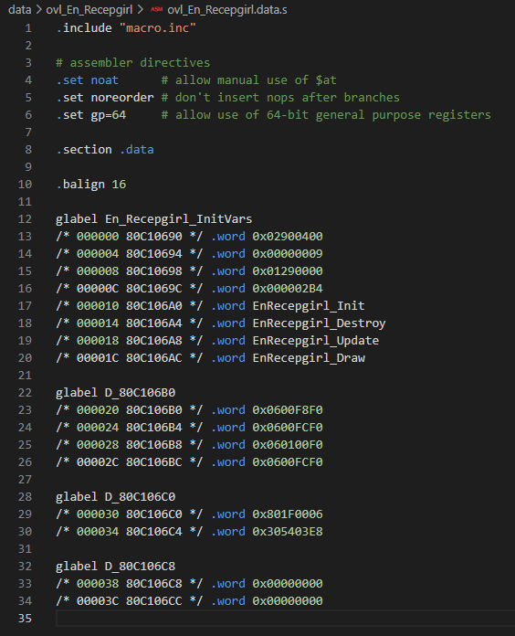
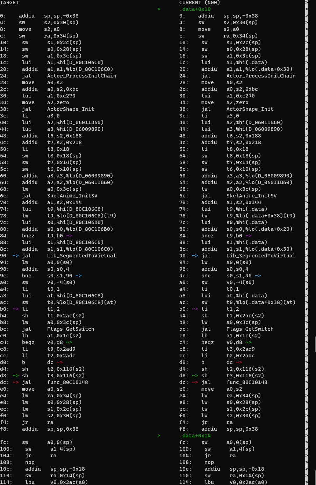

# Beginning decompilation: the Init function and the Actor struct

- Up: [Contents](contents.md)

Open the C file and the H file with your actor's name from the appropriate directory in `src/overlays/actors/`. These will be the main files we work with. We will be using EnRecepgirl (the rather forward Mayor's receptionist in the Mayor's residence in East Clock Town) as our example: it is a nice simple NPC with most of the common features of an NPC.

Each actor has associated to it a data file and one assembly file per function. During the process, we will transfer the contents of all or most of these into the main C file. VSCode's search feature usually makes it quite easy to find the appropriate files without troubling the directory tree.

## Anatomy of the C file

The actor file starts off looking like:

```C
// --------------- 1 ---------------
// --------------- 2 ---------------
#include "z_en_recepgirl.h"

#define FLAGS 0x00000009

#define THIS ((EnRecepgirl*)thisx)

// --------------- 3 ---------------
void EnRecepgirl_Init(Actor* thisx, PlayState* play);
void EnRecepgirl_Destroy(Actor* thisx, PlayState* play);
void EnRecepgirl_Update(Actor* thisx, PlayState* play);
void EnRecepgirl_Draw(Actor* thisx, PlayState* play);

// --------------- 4 ---------------
#if 0
ActorInit En_Recepgirl_InitVars = {
    /**/ ACTOR_EN_RECEPGIRL,
    /**/ ACTORCAT_NPC,
    /**/ FLAGS,
    /**/ OBJECT_BG,
    /**/ sizeof(EnRecepgirl),
    /**/ EnRecepgirl_Init,
    /**/ EnRecepgirl_Destroy,
    /**/ EnRecepgirl_Update,
    /**/ EnRecepgirl_Draw,
};

// static InitChainEntry sInitChain[] = {
static InitChainEntry D_80C106C0[] = {
    ICHAIN_U8(targetMode, 6, ICHAIN_CONTINUE),
    ICHAIN_F32(targetArrowOffset, 1000, ICHAIN_STOP),
};

#endif

// --------------- 5 ---------------
extern InitChainEntry D_80C106C0[];

extern UNK_TYPE D_06001384;
extern UNK_TYPE D_06009890;
extern UNK_TYPE D_0600A280;

// --------------- 6 ---------------
#pragma GLOBAL_ASM("asm/non_matchings/overlays/ovl_En_Recepgirl/EnRecepgirl_Init.s")

#pragma GLOBAL_ASM("asm/non_matchings/overlays/ovl_En_Recepgirl/EnRecepgirl_Destroy.s")

#pragma GLOBAL_ASM("asm/non_matchings/overlays/ovl_En_Recepgirl/func_80C100DC.s")

#pragma GLOBAL_ASM("asm/non_matchings/overlays/ovl_En_Recepgirl/func_80C10148.s")

#pragma GLOBAL_ASM("asm/non_matchings/overlays/ovl_En_Recepgirl/func_80C1019C.s")

#pragma GLOBAL_ASM("asm/non_matchings/overlays/ovl_En_Recepgirl/func_80C10290.s")

#pragma GLOBAL_ASM("asm/non_matchings/overlays/ovl_En_Recepgirl/func_80C102D4.s")

#pragma GLOBAL_ASM("asm/non_matchings/overlays/ovl_En_Recepgirl/EnRecepgirl_Update.s")

#pragma GLOBAL_ASM("asm/non_matchings/overlays/ovl_En_Recepgirl/func_80C10558.s")

#pragma GLOBAL_ASM("asm/non_matchings/overlays/ovl_En_Recepgirl/func_80C10590.s")

#pragma GLOBAL_ASM("asm/non_matchings/overlays/ovl_En_Recepgirl/EnRecepgirl_Draw.s")

```

It is currently divided into six sections as follows:

1. Description of the actor. This is not present for all actors, (and indeed, is not present here) but gives a short description based on what we know about the actor already. It may be inaccurate, so feel free to correct it after you understand the actor better, or add it. It currently has the form

```C
/*
 * File: z_en_recepgirl.c
 * Overlay: ovl_En_Recepgirl
 * Description: Mayor's receptionist
 */
```

2. Specific `include`s and `define`s for the actor. You may need to add more header files, but otherwise this section is unlikely to change.

3. These are prototypes for the "main four" functions that almost every actor has. You add more functions here if they need to be declared above their first use.

4. `if`'d-out section containing the `InitVars` and a few other common pieces of data. This can be ignored until we import the data.

5. A set of `extern`s. These refer to the data in the previous section, and, data that comes from other files, usually in the actor's corresponding object file. The latter point to addresses in the ROM where assets are stored (usually collision data, animations or display lists). These can simply be replaced by including the object file (see [Object Decompilation](object_decomp.md) for how this process works).

6. List of functions. Each `#pragma GLOBAL_ASM` is letting the compiler use the corresponding assembly file while we do not have decompiled C code for that function. The majority of the decompilation work is converting these functions into C that it looks like a human wrote.

## Header file

The header file looks like this at the moment:

```C
#ifndef Z_EN_RECEPGIRL_H
#define Z_EN_RECEPGIRL_H

#include "global.h"

struct EnRecepgirl;

typedef void (*EnRecepgirlActionFunc)(struct EnRecepgirl*, PlayState*);

typedef struct EnRecepgirl {
    /* 0x0000 */ Actor actor;
    /* 0x0144 */ char unk_144[0x164];
    /* 0x02A8 */ EnRecepgirlActionFunc actionFunc;
    /* 0x02AC */ char unk_2AC[0x8];
} EnRecepgirl; // size = 0x2B4

#endif // Z_EN_RECEPGIRL_H
```

The struct currently contains a variable that is the `Actor` struct, which all actors use one way or another, plus other items. Currently we don't know what most of those items are, so we have arrays of chars as padding instead, just so the struct is the right size. As we understand the actor better, we will be able to gradually replace this padding with the actual variables that the actor uses.

The header file is also used to declare structs and other information about the actor that is needed by other files (e.g. by other actors): one can simply `#include` the header rather than `extern`ing it.

## Order of decompilation

The general rule for order of decompilation is

- Start with `Init`, because it usually contains the most information about the structure of the actor. You can also do `Destroy`, which is generally simpler than `Init`.
- Next, decompile any other functions from the actor you have found in `Init`. You generally start with the action functions, because they return nothing and all take the same arguments,

```C
void func_80whatever(EnRecepgirl* this, PlayState* play);
```

- Decompile each action function in turn until you run out. Along the way, do any other functions in the actor for which you have discovered the argument types. (You are probably better doing depth-first on action functions than breadth-first: it's normally easier to follow along one branch of the actions than be thinking about several at once.)

- After you've run out, do `Update`. This usually provides the rest of the function tree, apart from possibly some draw functions.

- Finally, do the draw functions.

The above is a rough ordering for the beginner. As you become more experienced, you can deviate from this scheme, but the general principle remains that you should work on functions that you already know something about. (This is why it's good to start on actors: they are self-contained, we already know a lot about some of the functions, and the function flow tends to be both logical and provide information about every function.)

## Data



Associated to each actor is a `.data` file, containing data that the actor uses. This ranges from spawn positions, to animation information, to even assets that we have to extract from the ROM. Since the structure of the data is very inconsistent between actors, automatic importing has been very limited, so the vast majority must be done manually.

There are two ways of transfering the data into an actor: we can either

- import it all naively as words (`s32`s), which will still allow it to compile, and sort out the actual types later, or
- we can extern each piece of data as we come across it, and come back to it later when we have a better idea of what it is.

We will concentrate on the second here; the other is covered in [the document about data](data.md). Thankfully this means we essentially don't have to do anything to the data yet. Nevertheless, it is often quite helpful to copy over at least some of the data and leave it commented out for later replacement. *Data must go in the same order as in the data file, and data is "all or nothing": you cannot only import some of it*.

**WARNING** The way in which the data was extracted from the ROM means that there are sometimes "fake symbols" in the data, which have to be removed to avoid confusing the compiler. Thankfully it will turn out that this is not the case here.

(Sometimes it is useful to import the data in the middle of doing functions: you just have to choose an appropriate moment.)

Some actors also have a `.bss` file. This is just data that is initialised to 0, and can be imported immediately once you know what type it is, by declaring it without giving it a value. (bss is a significant problem for code files, but not *usually* for actors.)

## Init

The Init function sets up the various components of the actor when it is first loaded. It is hence usually very useful for finding out what is in the actor struct, and so we usually start with it. (Some people like starting with Destroy, which is usually shorter and simpler, but gives some basic information about the actor, but Init is probably best for beginners.)

### mips2c

The first stage of decompilation is done by a program called mips_to_c, often referred to as mips2c, which constructs a C interpretation of the assembly code based on reading it very literally. This means that considerable cleanup will be required to turn it into something that firstly compiles at all, and secondly looks like a human wrote it, let alone a Zelda developer from the late '90s.

The web version of mips2c can be found [here](https://simonsoftware.se/other/mips_to_c.py). This was [covered in the OoT tutorial](https://github.com/zeldaret/oot/blob/main/docs/tutorial/beginning_decomp.md). We shall instead use the repository. Clone [the mips_to_c repository](https://github.com/matt-kempster/mips_to_c) into a separate directory (we will assume on the same level as the `mm/` directory). Since it's Python, we don't have to do any compilation or anything in the mips_to_c directory.

Since the actor depends on the rest of the codebase, we can't expect to get much intelligible out of mips2c without giving it some context. We make this using a Python script in the `tools` directory called `m2ctx.py`, so run

```
$ ./tools/m2ctx.py <path_to_c_file>
```

from the main directory of the repository. In this case, the C file is `src/overlays/actors/ovl_En_Recepgirl/z_en_recepgirl.c`. This generates a file called `ctx.c` in the main directory of the repository.

To get mips_to_c to decompile a function, the bare minimum is to run

```
$ ../mips_to_c/mips_to_c.py <path_to_function_assembly_file>
```

(from the root directory of `mm`). We can tell mips2c to use the context file we just generated by adding `--context ctx.c`. If we have data, mips2c may be able to assist with that as well.

In this case, we want the assembly file for `EnRecepgirl_Init`. You can copy the path to the file in VSCode or similar, or just tab-complete it once you know the directory structure well enough: it turns out to be `asm/non_matchings/overlays/ovl_En_Recepgirl/EnRecepgirl_Init.s`.

**N.B.** You want the file in `nonmatchings`! the files in the other directories in `asm/` are the *unsplit* asm, which can be used, but is less convenient (you would need to include the rodata, for example, and it will do the whole file at once. This is sometimes useful, but we'll go one function at a time today to keep things simple).

We shall also include the data file, which is located at `data/overlays/ovl_En_Recepgirl/ovl_En_Recepgirl.data.s`. Hence the whole command will be

```
$ ../mips_to_c/mips_to_c.py asm/non_matchings/overlays/ovl_En_Recepgirl/EnRecepgirl_Init.s data/ovl_En_Recepgirl/ovl_En_Recepgirl.data.s --context ctx.c
? func_80C10148(EnRecepgirl *); // extern
extern FlexSkeletonHeader D_06011B60;
static void *D_80C106B0[4] = {(void *)0x600F8F0, (void *)0x600FCF0, (void *)0x60100F0, (void *)0x600FCF0};
static s32 D_80C106C8 = 0;
InitChainEntry D_80C106C0[2]; // unable to generate initializer

void EnRecepgirl_Init(EnRecepgirl* this, PlayState* play) {
    EnRecepgirl* this = (EnRecepgirl *) thisx;
    void **temp_s0;
    void **phi_s0;

    Actor_ProcessInitChain((Actor *) this, D_80C106C0);
    ActorShape_Init(&this->actor.shape, -60.0f, NULL, 0.0f);
    SkelAnime_InitFlex(play, (SkelAnime *) this->unk_144, &D_06011B60, (AnimationHeader *) &D_06009890, this + 0x188, this + 0x218, 0x18);
    phi_s0 = D_80C106B0;
    if (D_80C106C8 == 0) {
        do {
            temp_s0 = phi_s0 + 4;
            temp_s0->unk-4 = Lib_SegmentedToVirtual(*phi_s0);
            phi_s0 = temp_s0;
        } while (temp_s0 != D_80C106C0);
        D_80C106C8 = 1;
    }
    this->unk_2AC = 2;
    if (Flags_GetSwitch(play, (s32) this->actor.params) != 0) {
        this->actor.textId = 0x2ADC;
    } else {
        this->actor.textId = 0x2AD9;
    }
    func_80C10148(this);
}
```

Comment out the `GLOBAL_ASM` line for `Init`, and paste all of this into the file just underneath it:

```C
[...]
// #pragma GLOBAL_ASM("asm/non_matchings/overlays/ovl_En_Recepgirl/EnRecepgirl_Init.s")
? func_80C10148(EnRecepgirl *); // extern
extern FlexSkeletonHeader D_06011B60;
static void *D_80C106B0[4] = {(void *)0x600F8F0, (void *)0x600FCF0, (void *)0x60100F0, (void *)0x600FCF0};
static s32 D_80C106C8 = 0;
InitChainEntry D_80C106C0[2]; // unable to generate initializer

void EnRecepgirl_Init(Actor* thisx, PlayState* play) {
    EnRecepgirl* this = (EnRecepgirl *) thisx;
    void **temp_s0;
    void **phi_s0;

    Actor_ProcessInitChain((Actor *) this, D_80C106C0);
    ActorShape_Init(&this->actor.shape, -60.0f, NULL, 0.0f);
    SkelAnime_InitFlex(play, (SkelAnime *) this->unk_144, &D_06011B60, (AnimationHeader *) &D_06009890, this + 0x188, this + 0x218, 0x18);
    phi_s0 = D_80C106B0;
    if (D_80C106C8 == 0) {
        do {
            temp_s0 = phi_s0 + 4;
            temp_s0->unk-4 = Lib_SegmentedToVirtual(*phi_s0);
            phi_s0 = temp_s0;
        } while (temp_s0 != D_80C106C0);
        D_80C106C8 = 1;
    }
    this->unk_2AC = 2;
    if (Flags_GetSwitch(play, (s32) this->actor.params) != 0) {
        this->actor.textId = 0x2ADC;
    } else {
        this->actor.textId = 0x2AD9;
    }
    func_80C10148(this);
}
[...]
```

</details>

Typically for all but the simplest functions, there is a lot that needs fixing before we are anywhere near seeing how close we are to the original code. You will notice that mips2c creates a lot of temporary variables. Usually most of these will turn out to not be real, and we need to remove the right ones to get the code to match.

To allow the function to find the variables, we need another correction. Half of this has already been done at the top of the file, where we have

```C
#define THIS ((EnRecepgirl*)thisx)
```

To do the other half, replace the recast at the beginning of the function, before any declarations:

```C
EnRecepgirl* this = THIS;
```

Now everything points to the right place, even though the argument of the function seems inconsistent with the contents.

(Again: this step is only necessary for the "main four" functions, and sometimes functions that are used by these: it relates to how such functions are used outside the actor.)

While we are carrying out initial changes, you can also find-and-replace any instances of `(Actor *) this` by `&this->actor`. The function now looks like this:

```C
? func_80C10148(EnRecepgirl *); // extern
extern FlexSkeletonHeader D_06011B60;
static void *D_80C106B0[4] = {(void *)0x600F8F0, (void *)0x600FCF0, (void *)0x60100F0, (void *)0x600FCF0};
static s32 D_80C106C8 = 0;
InitChainEntry D_80C106C0[2]; // unable to generate initializer

void EnRecepgirl_Init(Actor* thisx, PlayState* play) {
    EnRecepgirl* this = THIS;
    void **temp_s0;
    void **phi_s0;

    Actor_ProcessInitChain(&this->actor, D_80C106C0);
    ActorShape_Init(&this->actor.shape, -60.0f, NULL, 0.0f);
    SkelAnime_InitFlex(play, (SkelAnime *) this->unk_144, &D_06011B60, (AnimationHeader *) &D_06009890, this + 0x188, this + 0x218, 0x18);
    phi_s0 = D_80C106B0;
    if (D_80C106C8 == 0) {
        do {
            temp_s0 = phi_s0 + 4;
            temp_s0->unk-4 = Lib_SegmentedToVirtual(*phi_s0);
            phi_s0 = temp_s0;
        } while (temp_s0 != D_80C106C0);
        D_80C106C8 = 1;
    }
    this->unk_2AC = 2;
    if (Flags_GetSwitch(play, (s32) this->actor.params) != 0) {
        this->actor.textId = 0x2ADC;
    } else {
        this->actor.textId = 0x2AD9;
    }
    func_80C10148(this);
}
```

### (Not) dealing with Data

For now, we do not want to consider the data that mips2c has kindly imported for us: it will only get in the way when we want to rebuild the file to check for OK (`diff.py` will not care, but `make` will complain if it notices a symbol defined twice, and if some data is included twice the ROM will not match anyway). Therefore, put it in the `#if`'d out section and add some externs with the types:

```C
#if 0
ActorInit En_Recepgirl_InitVars = {
    /**/ ACTOR_EN_RECEPGIRL,
    /**/ ACTORCAT_NPC,
    /**/ FLAGS,
    /**/ OBJECT_BG,
    /**/ sizeof(EnRecepgirl),
    /**/ EnRecepgirl_Init,
    /**/ EnRecepgirl_Destroy,
    /**/ EnRecepgirl_Update,
    /**/ EnRecepgirl_Draw,
};

static void* D_80C106B0[4] = { (void*)0x600F8F0, (void*)0x600FCF0, (void*)0x60100F0, (void*)0x600FCF0 };

// static InitChainEntry sInitChain[] = {
static InitChainEntry D_80C106C0[] = {
    ICHAIN_U8(targetMode, 6, ICHAIN_CONTINUE),
    ICHAIN_F32(targetArrowOffset, 1000, ICHAIN_STOP),
};

static s32 D_80C106C8 = 0;

#endif

extern void* D_80C106B0[];
extern InitChainEntry D_80C106C0[];
extern s32 D_80C106C8;
```

**N.B.** As is covered in more detail in [the document about data](data.md), the data *must* be declared in the same order in C as it was in the data assembly file: notice that the order in this example is `En_Recepgirl_InitVars`, `D_80C106B0`, `D_80C106C0`, `D_80C106C8`, the same as in `data/ovl_En_Recepgirl/ovl_En_Recepgirl.data.s`.

In the next sections, we shall sort out the various initialisation functions that occur in Init. This actor contains several of the most common ones, but it does not have, for example, a collider. The process is similar to what we discuss below, or you can check the OoT tutorial.

<!-- ### Data and function prototypes

Let's first look at the block of stuff that mips2c has put above the function. This usually contains useful information, but often needs work to make it compile and be in the right place. -->

### Init chains

Almost always, one of the first items in `Init` is a function that looks like

```C
Actor_ProcessInitChain(&this->actor, D_80C106C0);
```

which initialises common properties of actor using an InitChain, which is usually somewhere near the top of the data, in this case in the variable `D_80C106C0`. This is already included in the `#if`'d out data at the top if the file, so we don't have to do anything for now. We can correct the mips2c output for the extern, though: I actually did this when moving the rest of the data in the previous section.

### SkelAnime

This is the combined system that handles actors' skeletons and their animations. It is the other significant part of most actor structs. We see its initialisation in this part of the code:

```C
    Actor_ProcessInitChain(&this->actor, D_80C106C0);
    ActorShape_Init(&this->actor.shape, -60.0f, NULL, 0.0f);
    SkelAnime_InitFlex(play, (SkelAnime *) this->unk_144, &D_06011B60, (AnimationHeader *) &D_06009890, this + 0x188, this + 0x218, 0x18);
    phi_s0 = D_80C106B0;
```

An actor with SkelAnime has three structs in the Actor struct that handle it: one called SkelAnime, and two arrays of `Vec3s`, called `jointTable` and `morphTable`. Usually, although not always, they are next to one another.

There are two different sorts of SkelAnime, although for decompilation purposes there is not much difference between them. Looking at the prototype of `SkelAnime_InitFlex` from `functions.h` (or even the definition in `z_skelanime.c`),

```C
void SkelAnime_InitFlex(PlayState* play, SkelAnime* skelAnime, FlexSkeletonHeader* skeletonHeaderSeg,
                      AnimationHeader* animation, Vec3s* jointTable, Vec3s* morphTable, s32 limbCount);
```

we can read off the types of the various arguments:

- The `SkelAnime` struct is at `this + 0x144`
- The `jointTable` is at `this + 0x188`
- The `morphTable` is at `this + 0x218`
- The number of limbs is `0x18 = 24` (we use dec for the number of limbs)
- Because of how SkelAnime works, this means that the `jointTable` and `morphTable` both have `24` elements

Looking in `z64animation.h`, we find that `SkelAnime` has size `0x44`, and looking in `z64math.h`, that `Vec3s` has size `0x6`. Since ` 0x144 + 0x44 = 0x188 `, `jointTable` is immediately after the `SkelAnime`, and since `0x188 + 0x6 * 0x18 = 0x218`, `morphTable` is immediately after the `jointTable`. Finally, `0x218 + 0x6 * 0x18 = 0x2A8`, and we have filled all the space between the `actor` and `actionFunc`. Therefore the struct now looks like

```C
typedef struct EnRecepgirl {
    /* 0x0000 */ Actor actor;
    /* 0x0144 */ SkelAnime skelAnime;
    /* 0x0188 */ Vec3s jointTable[24];
    /* 0x0218 */ Vec3s morphTable[24];
    /* 0x02A8 */ EnRecepgirlActionFunc actionFunc;
    /* 0x02AC */ char unk_2AC[0x8];
} EnRecepgirl; // size = 0x2B4
```

The last information we get from the SkelAnime function is the types of two of the externed symbols: `D_06011B60` is a `FlexSkeletonHeader`, and `D_06009890` is an `AnimationHeader`. So we can change/add these at the top of the C file:

```C
extern InitChainEntry D_80C106C0[];

extern UNK_TYPE D_06001384;
extern AnimationHeader D_06009890;
extern UNK_TYPE D_0600A280;
extern FlexSkeletonHeader D_06011B60;
```

As with the data, these externed symbols should be kept in increasing address order.

They are both passed to the function as pointers, so need `&` to pass the address instead of the actual data. Hence we end up with

```C
    SkelAnime_InitFlex(play, &this->skelAnime, &D_06011B60, &D_06009890, this->jointTable, this->morphTable, 24);
```

note that `this->jointTable` and `this->morphTable` are arrays, so are already effectively pointers and don't need a `&`.

### More struct variables: a brief detour into reading some assembly

This function also gives us information about other things in the struct. The only other reference to `this` (rather than `this->actor` or similar) is in

```C
this->unk_2AC = 2;
```

This doesn't tell us much except that at `this + 0x2AC` is a number of some kind. What sort of number? For that we will have to look in the assembly code. This will probably look quite intimidating the first time, but it's usually not too bad if you use functions as signposts: IDO will never change the order of function calls, and tends to keep code between functions in roughly the same place, so you can usually guess where you are.

In this case, we are looking for `this + 0x2AC`. `0x2AC` is not a very common number, so hopefully the only mention of it is in referring to this struct variable. Indeed, if we search the file, we find that the only instruction mentioning `0x2AC` is here:

```mips
/* 0000B0 80C10080 24090002 */  addiu       $t1, $zero, 2
/* 0000B4 80C10084 A24902AC */  sb          $t1, 0x2ac($s2)
```

`addiu` ("add unsigned immediate") adds the last two things and puts the result in the register in the first position. So this says `$t1 = 0 + 2`. The next instruction, `sb` ("store byte") puts the value in the register in the first position in the memory location in the second, which in this case says `$s2 + 0x2ac = $t1`. We can go and find out what is in `$s2` is: it is set *all* the way at the top of the function, in this line:

```mips
/* 000008 80C0FFD8 00809025 */  move        $s2, $a0
```

This simply copies the contents of the second register into the first one. In this case, it is copying the contents of the function's first argument into `$s2` (because it wants to use it later, and the `$a` registers are assumed to be cleared after a function call). In this case, the first argument is a pointer to `this` (well, `thisx`, but the struct starts with an `Actor`, so it's the same address). So line `B4` of the asm really is saving `2` into the memory location `this + 0x2AC`.

Anyway, this tells us that the variable is a byte of some kind, so `s8` or `u8`: if it was an `s16/u16` it would have said `sh`, and if it was an `s32/u32` it would have said `sw`. Unfortunately this is all we can determine from this function: MIPS does not have separate instructions for saving signed and unsigned bytes.

At this point you have two options: guess based on statistics/heuristics, or go and look in the other functions in the actor to find out more information. The useful statistic here is that `u8` is far more common than `s8`, but let's look in the other functions, since we're pretty confident after finding `0x2ac` so easily in `Init`. So, let us grep the actor's assembly folder:

```
$ grep -r '0x2ac' asm/non_matchings/overlays/ovl_En_Recepgirl/
asm/non_matchings/overlays/ovl_En_Recepgirl/EnRecepgirl_Draw.s:/* 00065C 80C1062C 921902AC */  lbu         $t9, 0x2ac($s0)
asm/non_matchings/overlays/ovl_En_Recepgirl/func_80C100DC.s:/* 000114 80C100E4 908202AC */  lbu         $v0, 0x2ac($a0)
asm/non_matchings/overlays/ovl_En_Recepgirl/func_80C100DC.s:/* 00012C 80C100FC A08E02AC */   sb         $t6, 0x2ac($a0)
asm/non_matchings/overlays/ovl_En_Recepgirl/func_80C100DC.s:/* 000134 80C10104 A08002AC */   sb         $zero, 0x2ac($a0)
asm/non_matchings/overlays/ovl_En_Recepgirl/func_80C100DC.s:/* 00015C 80C1012C 909802AC */  lbu         $t8, 0x2ac($a0)
asm/non_matchings/overlays/ovl_En_Recepgirl/func_80C100DC.s:/* 000164 80C10134 A09902AC */  sb          $t9, 0x2ac($a0)
asm/non_matchings/overlays/ovl_En_Recepgirl/EnRecepgirl_Init.s:/* 0000B4 80C10084 A24902AC */  sb          $t1, 0x2ac($s2)
```

in which we clearly see `lbu` ("load byte unsigned"), and hence this variable really is a `u8`. Hence we can add this to the actor struct too:

```C
typedef struct EnRecepgirl {
    /* 0x0000 */ Actor actor;
    /* 0x0144 */ SkelAnime skelAnime;
    /* 0x0188 */ Vec3s jointTable[24];
    /* 0x0218 */ Vec3s morphTable[24];
    /* 0x02A8 */ EnRecepgirlActionFunc actionFunc;
    /* 0x02AC */ u8 unk_2AC;
    /* 0x02AD */ char unk_2AD[0x7];
} EnRecepgirl; // size = 0x2B4
```

You might think that was a lot of work for one variable, but it's pretty quick when you know what to do. Obviously this would be more difficult with a more common number, but it's often still worth trying.

Removing some of the declarations for data that we have accounted for, the function now looks like this:

```C
? func_80C10148(EnRecepgirl *); // extern

void EnRecepgirl_Init(Actor* thisx, PlayState* play) {
    EnRecepgirl* this = THIS;
    void **temp_s0;
    void **phi_s0;

    Actor_ProcessInitChain(&this->actor, D_80C106C0);
    ActorShape_Init(&this->actor.shape, -60.0f, NULL, 0.0f);
    SkelAnime_InitFlex(play, &this->skelAnime, &D_06011B60, &D_06009890, this->jointTable, this->morphTable, 24);

    phi_s0 = D_80C106B0;
    if (D_80C106C8 == 0) {
        do {
            temp_s0 = phi_s0 + 4;
            temp_s0->unk-4 = Lib_SegmentedToVirtual(*phi_s0);
            phi_s0 = temp_s0;
        } while (temp_s0 != D_80C106C0);
        D_80C106C8 = 1;
    }

    this->unk_2AC = 2;
    if (Flags_GetSwitch(play, (s32) this->actor.params) != 0) {
        this->actor.textId = 0x2ADC;
    } else {
        this->actor.textId = 0x2AD9;
    }
    func_80C10148(this);
}
```

We have one significant problem and a few minor ones left.

### Casts and boolean functions

mips2c likes casting a lot: this is useful for getting types, less so when the type is changed automatically, such as in `Flags_GetSwitch(play, (s32) this->actor.params)`. Also, if we look at this function's definition, we discover it will only return `true` or `false`, so we can remove the `!= 0`.

### Functions called

One minor problem is what `func_80C10148` is: C needs a prototype to compile it properly. mips2c has offered us `? func_80C10148(EnRecepgirl *); // extern`, but this is obviously incomplete: there's no `?` type in C! We shall guess for now that this function returns `void`, for two reasons:

1. It's not used as a condition in a conditional or anything
2. It's not used to assign a value

To this experience will add a third reason:
3. This is probably a setup function for an actionFunc, which are usually either `void (*)(ActorType*)` or `void (*)(ActorType*, PlayState*)`.

The upshot of all this is to remove mips2c's `? func_80C10148(EnRecepgirl *); // extern`, and add a `void func_80C10148(EnRecepgirl* this);` underneath the declarations for the main four functions:

```C
void EnRecepgirl_Init(Actor* thisx, PlayState* play);
void EnRecepgirl_Destroy(Actor* thisx, PlayState* play);
void EnRecepgirl_Update(Actor* thisx, PlayState* play);
void EnRecepgirl_Draw(Actor* thisx, PlayState* play);

void func_80C10148(EnRecepgirl* this);
```

(we usually leave a blank line after the main four, and put all further declarations in address order).

### Loops

Loops are often some of the hardest things to decompile, because there are many ways to write a loop, only some of which will generate the same assembly. mips2c has had a go at the one in this function, but it usually struggles with loops: don't expect it to get a loop correct, well, at all.

The code in question is

```C
    void **temp_s0;
    void **phi_s0;

[...]

    phi_s0 = D_80C106B0;
    if (D_80C106C8 == 0) {
        do {
            temp_s0 = phi_s0 + 4;
            temp_s0->unk-4 = Lib_SegmentedToVirtual(*phi_s0);
            phi_s0 = temp_s0;
        } while (temp_s0 != D_80C106C0);
        D_80C106C8 = 1;
    }
```

`D_80C106B0` is the array that mips2c has declared above the function, a set of 8-digit hex numbers starting `0x06`. These are likely to be *segmented pointers*, but this is not a very useful piece of information yet. `D_80C106C0` is the InitChain, though, and it seems pretty unlikely that it would be seriously involved in any sort of loop. Indeed, if you tried to compile this now, you would get an error:

```
cfe: Error: src/overlays/actors/ovl_En_Recepgirl/z_en_recepgirl.c, line 61: Unacceptable operand of == or !=
         } while (temp_s0 != D_80C106C0);
 -------------------------^
```

so this can't possibly be right.

So what on earth is this loop doing? Probably the best thing to do is manually unroll it and see what it's doing each time.

1. `phi_s0 = D_80C106B0`, aka `&D_80C106B0[0]`, to `temp_s0 = D_80C106B0 + 4`, i.e. `&D_80C106B0[1]`. But then `temp_s0->unk-4` is 4 backwards from `&D_80C106B0[1]`, which is back at `&D_80C106B0[0]`; the `->` means to look at what is at this address, so `temp_s0->unk-4` is `D_80C106B0[0]`. Equally, `*phi_s0` is the thing at `&D_80C106B0[0]`, i.e. `D_80C106B0[0]`. So the actual thing the first pass does is

```C
    D_80C106B0[0] = Lib_SegmentedToVirtual(D_80C106B0[0]);
```

it then proceeds to set `phi_s0 = &D_80C106B0[1]` for the next iteration.

2. We go through the same reasoning and find the inside of the loop is

```C
    temp_s0 = &D_80C106B0[2];
    D_80C106B0[1] = Lib_SegmentedToVirtual(D_80C106B0[1]);
    phi_s0 = &D_80C106B0[2];
```

3. 

```C
    temp_s0 = &D_80C106B0[3];
    D_80C106B0[2] = Lib_SegmentedToVirtual(D_80C106B0[2]);
    phi_s0 = &D_80C106B0[3];
```

4. 

```C
    temp_s0 = &D_80C106B0[4];
    D_80C106B0[3] = Lib_SegmentedToVirtual(D_80C106B0[3]);
    phi_s0 = &D_80C106B0[4];
```

But now, `&D_80C106B0[4] = D_80C106B0 + 4 * 4 = D_80C106B0 + 0x10`, and `0x10` after this array's starting address is `D_80C106C0`, i.e. the InitChhain. Hence at this point the looping ends.

So what this loop actually does is run `Lib_SegmentedToVirtual` on each element of the array `D_80C106B0`.

At this point, I confess that I guessed what this loop does, and rewrote it how I would have written it, namely how one usually iterates over an array:

```C
    s32 i;
[...]
    for (i = 0; i < 4; i++) {
        D_80C106B0[i] = Lib_SegmentedToVirtual(D_80C106B0[i]);
    }
```

This is a dangerous game, since there is no guarantee that what you think is the right way to write something bears any relation to either what the original was like, or more importantly, what will give the same codegen as the original. This is a significant leap, since the original appears to be using a pointer iterator!

However, this is certainly at least equivalent to the original (or at least, to what mips2c gave us: it's not infallible): we can be certain of this because we wrote the thing out in its entirety to understand it! This also allows us to eliminate one of the temps: you'll find with even simple loops mips2c will usually make two temps for the loop variable.

Hence we end up with

```C
void func_80C10148(EnRecepgirl* this);
[...]

void EnRecepgirl_Init(Actor* thisx, PlayState* play) {
    EnRecepgirl* this = THIS;

    Actor_ProcessInitChain(&this->actor, D_80C106C0);
    ActorShape_Init(&this->actor.shape, -60.0f, NULL, 0.0f);
    SkelAnime_InitFlex(play, &this->skelAnime, &D_06011B60, &D_06009890, this->jointTable, this->morphTable, 24);

    if (D_80C106C8 == 0) {
        for (i = 0; i < 4; i++) {
            D_80C106B0[i] = Lib_SegmentedToVirtual(D_80C106B0[i]);
        }
        D_80C106C8 = 1;
    }

    this->unk_2AC = 2;

    if (Flags_GetSwitch(play, this->actor.params)) {
        this->actor.textId = 0x2ADC;
    } else {
        this->actor.textId = 0x2AD9;
    }

    func_80C10148(this);
}
```

as our first guess. This doesn't look unreasonable... the question is, does it match?

## Diff

Once preliminary cleanup and struct filling is done, most time spent matching functions is done by comparing the original code with the code you have compiled. This is aided by a program called `diff.py`.

In order to use `diff.py` with the symbol names, we need a copy of the code to compare against. In MM this is done as part of `make init`, and you can regenerate the `expected` directory (which is simply a known-good copy of `build` directory) by running `make diff-init`, which will check for an OK ROM and copy the build directory over. (Of course you need an OK ROM to do this; worst-case, you can checkout main and do a complete rebuild to get it). (You need to remake `expected` if you want to diff a function you have renamed: `diff.py` looks in the mapfiles for the function name, which won't work if the name has changed!)

Now, we run diff on the function name: in the main directory,

```
$ ./diff.py -mwo3 EnRecepgirl_Init
```

(To see what these arguments do, run it with `./diff.py -h` or look in the scripts documentation.)



And err, well, everything is white, so it matches. Whoops. Guess we'll cover `diff.py` properly next time! (Notice that even though the diff is completely white, there are some differences in the `%hi`s and `%lo`s that access data, because it is now accessed with a relative address rather than an absolute one. If you have the data in the file in the right order, this shouldn't matter.)

And with that, we have successfully matched our first function.

**N.B** Notice that we don't yet have much idea of what this code actually does: this should be clarified by going through the rest of the actor's functions, which is discussed in the next document.

Next: [Other functions in the actor](other_functions.md)
