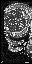

# Object Decompilation

- Up: [Contents](contents.md)
- Previous: [Documenting](documenting.md)

Object decompilation is the process of taking an object file and writing instructions to extract the various assets from it in the correct format, with appropriate labelling to distinguish their nature and/or use.

## What is an object file?

An object file is generally where most of the information used by overlays is stored. Its contents can include

- Vertices (positional/normal/color data used by displaylists)
- Textures
- DisplayLists (instructions to the graphics processor on how to put together textures and vertices)
- Skeleton (The underlying structure of an actor's shape, that can be manipulated to change its "pose")
- Animations
- Texture Animations (instructions to scroll/cycle textures or change colors)

## How we work with objects

These objects are considered assets so they are not included in the repository directly. Instead we use the Zelda Asset Processor for Decompilation (ZAPD) to extract them from the ROM. As input, ZAPD takes an XML file that describes what and how to extract. Each object already has an autogenerated XML created in the `assets/xml/objects` directory, though they are incomplete with just autogenerated names. The goal of object decompilation is to complete these files by identifying any remaining blobs and giving everything proper names.

## How to decomp an object

Choose an object to decomp. As usual, some will be easier than others. For reasons explained shortly, it is much easier to decomp an object if all actors that use it are decompiled.

### Files and folders

Select the XML file of your selected object, which should be in `assets/xml/objects/object_name.xml`.

The ZAPD output will go in the folder `assets/objects/object_name/`. You'll want this folder open later to check the output is correct.

### Examining actor files

All objects have had their XML generated in an automated way, so most constituent parts of each object are already identified, but will still need to be named and documented properly. Further, these objects usually have some blobs unreferenced by the object's own contents and hence not automatically extracted; most of the time these can be identified by looking at references in the actor which uses said object.

### Extracting assets

You can run `extract_assets.py` to extract the object's assets. Running it with no arguments extracts all files that have been updated since the last time it was run. You can also run it with `-s` (for single file), and give it the location of the object you want to extract relative to `assets`, i.e.

```bash
./extract_assets.py -s objects/object_name
```

This should populate the folder you created earlier. ZAPD produces a C file containing the extracted object data, which will be `assets/objects/object_name/object_name.c`. Any data that you have not specified the type of, or is not referenced elsewhere in the object, is extracted as unknown blobs  (usually named `unaccounted_XXXXXX`).  Open the C file to see if there are any such blobs. (Some are just padding with 0s and can be ignored.)

You now have to try and decipher these blobs using the [list of tools given below](#tools) to work out what they might be. In the case of unused parts of the object, this can be very difficult.

### Naming

You'll want to name everything that exists in the XML, but it helps to break it down into separate steps. After each step, extract the single asset again.

1. First, name every piece of data that is directly accessed by another part of the repo (generally, but not always, actors). For most objects, this includes several of a skeleton, animations, some textures, and collision information.

2. Then, name the limbs associated with each skeleton. This is usually straightforward, providing Z64Utils can show the skeleton properly. Note that when naming limbs, you should name them *from the object's perspective*, so the "left arm" is the one that is to the *object's* left. As part of this step, you should also replace the autogenerated enum values associated with each limb with an appropriate name. Another thing to note is that some limbs are considered "Root" limbs that are simply parents to other limbs and don't actually render anything themselves. In these cases, you can simply add `Root` to the limb name, e.g., `gGibdoRightLegRootLimb`.

3. Next, name the display lists that are associated to limbs in the skeleton. Z64Utils can show you which display list is associated with a given limb.

4. If any non-limb display lists still lack a name, try naming them now.

5. Lastly, try to name every texture in the object. This can be a bit tricky just by looking at the textures, so it helps to see how they're used in the display lists. You can also try manipulating the textures, recompiling the game, and loading up the resulting ROM to see what your changes look like in-game.

You'll notice that we didn't mention vertices in this list. This is because, for the most part, vertices are not used outside the object itself, and so are not required to have names. However, some actors have code that manipulates or otherwise interacts with vertices; in these cases, the vertices should be added to the XML and named.

Current naming practice is to name each item in the xml using camelCase as usual, with the `g` prefix (for "global"), and the type of data last (`Skel`, `Anim`, `DL`, `Tex`, `TLUT`, `Vtx`, `TexAnim`, etc.), while output texture files are named in `snake_case`. TLUTs (texture look-up tables) should always have their output file end in `tlut`. For more info on which suffixes to use, check out the [ZAPD documentation on extraction XML](https://github.com/zeldaret/mm/blob/master/tools/ZAPD/docs/zapd_extraction_xml_reference.md).

### Textures

Since all objects have an autogenerated XML, most textures in the game already have an entry in an XML file. However, some did not get automatically detected, and textures can be especially troublesome due to the abundance of formats they can be in. Some are simple RGBA textures, while others use external palettes, and can look meaningless without. If the texture is used in a displaylist, it will tell you the format, but if not, you have to use your best judgement based on anything you know about its context.

The order of operations is that palettes are loaded first, then the texture, and then the vertices to which it is applied.

The first argument of `gsDPLoadTextureBlock` tells you the offset, the second the format, the third the bit depth, fourth the width and fifth the height

The following is a list of the texture formats the Nintendo 64 supports, with their gfxdis names and ZAPD format names.


| Format name                                     | Typing in `gsDPLoadTextureBlock` | "Format" in xml |
| ----------------------------------------------- | -------------------------------- | --------------- |
| 4-bit intensity (I)                             | `G_IM_FMT_I, G_IM_SIZ_4b`        | i4              |
| 4-bit intensity with alpha (I/A) (3/1)          | `G_IM_FMT_IA, G_IM_SIZ_4b`       | ia4             |
| 4-bit color index (CI)                          | `G_IM_FMT_CI, G_IM_SIZ_4b`       | ci4             |
| 8-bit I                                         | `G_IM_FMT_I, G_IM_SIZ_8b`        | i8              |
| 8-bit IA (4/4)                                  | `G_IM_FMT_IA, G_IM_SIZ_8b`       | ia8             |
| 8-bit CI                                        | `G_IM_FMT_CI, G_IM_SIZ_8b`       | ci8             |
| 16-bit red, green, blue, alpha (RGBA) (5/5/5/1) | `G_IM_FMT_RGBA, G_IM_SIZ_16b`    | rgba16          |
| 16-bit IA (8/8)                                 | `G_IM_FMT_IA, G_IM_SIZ_16b`      | ia16            |
| 16-bit YUV (Luminance, Blue-Y, Red-Y)           | `G_IM_FMT_YUV, G_IM_SIZ_16b`     | (not used)      |
| 32-bit RGBA (8/8/8/8)                           | `G_IM_FMT_RGBA, G_IM_SIZ_32b`    | rgba32          |

The 4-bit formats are loaded using `gDPLoadTextureBlock_4b`. The others use `gDPLoadTextureBlock`.

For example,

```c
gsDPLoadTextureBlock(D_06006110, G_IM_FMT_RGBA, G_IM_SIZ_16b, 16, 16, 0, G_TX_NOMIRROR | G_TX_CLAMP, G_TX_NOMIRROR | G_TX_CLAMP, 4, 4, 0, 0),
```

says that there is a texture at offset `0x6110`, its Format is `rgba16`, Width is `16` and Height is `16`, so we can declare

```XML
<Texture Name="gObjectNameSomethingTex" OutName="object_name_something" Format="rgba16" Width="16" Height="16" Offset="0x6110"/>
```

See [this web page](http://n64devkit.square7.ch/tutorial/graphics/3/3_3.htm) for more information about these formats, and [gSP functions](http://n64devkit.square7.ch/n64man/gsp/gSP_INDEX.htm) and [gDP functions](http://n64devkit.square7.ch/n64man/gdp/gDP_INDEX.htm) for more about the graphics functions used.

The `ci` formats use palettes, which are declared separately. The shape you give the palette does not matter, but to avoid overlap errors it needs to fit into a rectangle; choose the one you think looks best, and if in doubt, just do height 1 and appropriate width.

If in doubt, look at completed objects in the repo, and if still in doubt, ask.

## Tools

We are very fortunate that several nice tools have been written recently that are excellent for documenting asset files:
- [Z64Utils](https://github.com/Random06457/Z64Utils/releases), for looking at displaylists, textures they reference, the skeleton, animations, etc.
- [Texture64](https://github.com/queueRAM/Texture64/releases), for looking at textures in all the common N64 formats (needed since Z64Utils cannot interpret textures not explicitly referenced in displaylists currently)

## Building and investigative modding

Thankfully it is not necessary to do a full make from clean to check that a particular object file has been decompiled successfully.

- With a valid xml file, run `extract_assets.py -s` on its object.
- `make`

If you want to change a texture, for example to see precisely where it is used, the following steps ensure it will be used in the build

- Change and save the texture. You can simply open the texture's PNG file in most image editors (e.g., Photoshop, GIMP, Paint, etc.) and edit it to your liking, though you'll need to keep the original palette in mind for palettized textures.
- Touch the object's main C file (in the same directory)
- make
- Ironically, ERROR 1 implies success (your new texture has changed the checksum).

If you'd rather not have it tell you about the checksum, you can run `make COMPARE=0` instead.

---

To revert to the original texture, you can just run `extract_assets.py -s` on the object again.

N.B. doing this will overwrite every custom texture, as will running `make setup`.

## Example

An example of decompiling a particular object is given [here](object_decomp_example.md).

## Tips and Tricks

### Fixing improper-looking textures

For CI4 and CI8 textures, you might see improper-looking textures like so:



The reason this happens is because ZAPD couldn't determine the TLUT for the texture, so it couldn't use the proper palette. To fix this, you can supply a `TlutOffset` to the texture like so:
```xml
<Texture Name="gGiantFaceEyeOpenTex" OutName="giant_face_eye_open" Format="ci8" Width="32" Height="64" Offset="0x5A80" TlutOffset="0x5380" />
```

### Understanding texture animations

Texture animations are new to Majora's Mask, and they can be pretty tricky to understand. Luckily, there's some extensive documentation on how they're structured [here](https://github.com/zeldaret/mm/blob/master/tools/ZAPD/ZAPD/ZTextureAnimation.cpp). One useful thing to remember is that empty texture animations take the form of `00 00 00 06 00 00 00 00`. The process that automatically generated all the object XMLs sometimes failed to recognize this as an empty texture animation, so it puts it in various blobs or fails to account for it at all.

Next: [The merging process](merging.md)