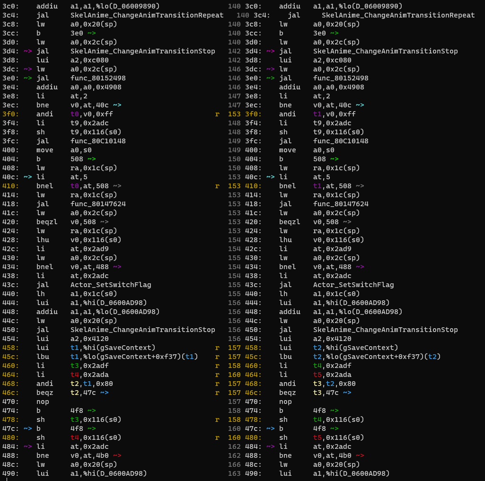
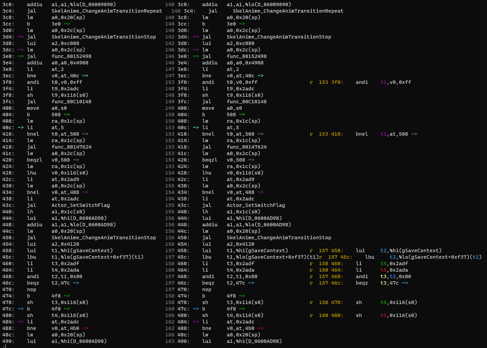
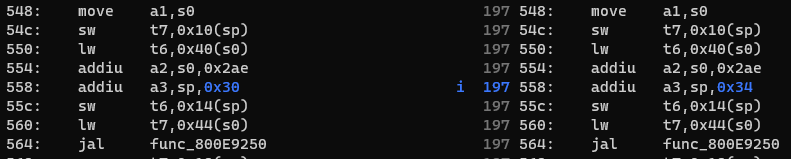
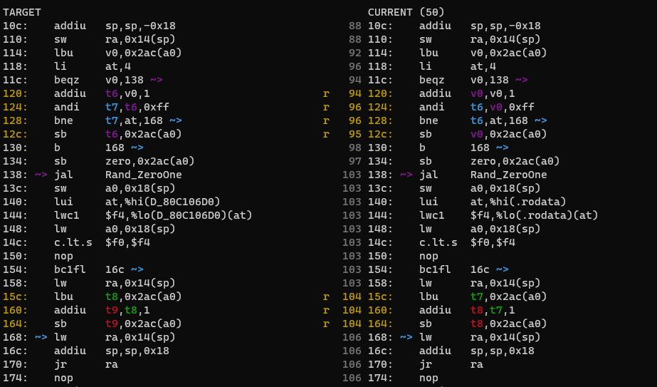
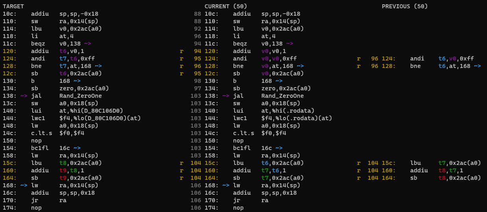
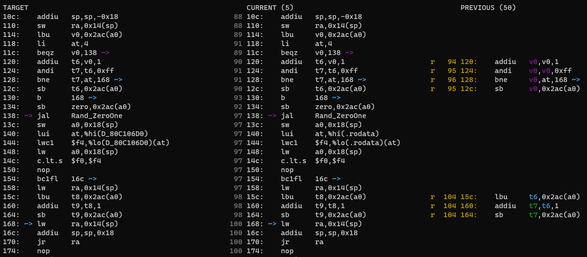

# The rest of the functions in the actor

- Up: [Contents](contents.md)
- Previous: [Beginning decompilation: the Init function and the Actor struct](beginning_decomp.md)

## Now what?

At this point we have a choice to make. Either we could follow the main function flow and decompile `func_80C10148`, or take a look at `Destroy`, which for smaller actors can often be done straight after Init, since it usually just removes colliders and deallocates dynapoly.

## Destroy

Destroy will be a dead end, but we might as well do it now. Usually we would regenerate the context first and apply it to mips2c as with `Init`, but if we look at the assembly...

```mips
glabel EnRecepgirl_Destroy
/* 0000FC 80C100CC AFA40000 */  sw          $a0, ($sp)
/* 000100 80C100D0 AFA50004 */  sw          $a1, 4($sp)
/* 000104 80C100D4 03E00008 */  jr          $ra
/* 000108 80C100D8 00000000 */   nop
```

It doesn't seem to do anything. Indeed, chucking it in mips2c,

```
$ ../mips_to_c/mips_to_c.py asm/non_matchings/overlays/ovl_En_Recepgirl/EnRecepgirl_Destroy.s
void EnRecepgirl_Destroy(s32 arg0, ? arg1) {

}
```

so it really does do nothing. It is worth staying on this briefly to understand what is is doing, though. Even with no context, mips2c knows it takes two arguments because it does two saves onto the stack: the calling convention the N64 uses requires the first four arguments be saved from the registers onto the stack, since the registers are expected to be cleared when a function call happens. It's done a bad job of guessing what they are, but that's to be expected: the assembly only tells us they're words. Thankfully we already know in this case, so we can just replace the `GLOBAL_ASM` by

```C
void EnRecepgirl_Destroy(Actor* thisx, PlayState* play) {

}
```

and cross this function off.

## `func_80C10148`

We don't really have a choice now, we have to look at this function. Remake the context (no need to change the function type this time), and run mips2c on the function's assembly file:

```
$ ../mips_to_c/mips_to_c.py asm/non_matchings/overlays/ovl_En_Recepgirl/func_80C10148.s data/ovl_En_Recepgirl/ovl_En_Recepgirl.data.s --context ctx.c
extern AnimationHeader D_0600AD98;
extern ? func_80C1019C;

void func_80C10148(EnRecepgirl *this) {
    SkelAnime *temp_a0;

    temp_a0 = &this->skelAnime;
    if (&D_06001384 == this->skelAnime.animation) {
        this = this;
        Animation_MorphToPlayOnce(temp_a0, &D_0600AD98, 5.0f);
    }
    this->actionFunc = &func_80C1019C;
}
```

This gives us some information immediately: `D_0600AD98` is an `AnimationHeader`, and `func_80C1019C` is set as the action function. This means that we know its type, even though mips2c does not: looking in the header, we see the typedef is

```C
typedef void (*EnRecepgirlActionFunc)(struct EnRecepgirl*, PlayState*);
```

and so we prototype `func_80C1019C` as

```C
void func_80C1019C(EnRecepgirl* this, PlayState* play);
```

at the top (were it above the function we're currently working on, the prototype could eventually be replaced by the function definition itself, but since it isn't, it goes at the top with the others).

There are several rather odd things going on here:

- `temp_a0` is only used once. As such it's probably fake. 
- There's a weird `this = this` that does nothing
- `if (&D_06001384 == this->skelAnime.animation)` is a bit of a funny way to write the condition: it seems more likely it would be the other way round. 
- Also, if we look up `animation`, we find it is an `AnimationHeader*`, so `D_06001384` can be externed as `AnimationHeader`.
- `func_80C1019C` is already a pointer, so the `&` is ineffectual. Our style is to not use `&` on function pointers.

If we tackle these, we end up with

```C

void func_80C10148(EnRecepgirl* this);
void func_80C1019C(EnRecepgirl* this, PlayState* play);

[...]

extern AnimationHeader D_06001384;
extern AnimationHeader D_06009890;
extern UNK_TYPE D_0600A280;
extern AnimationHeader D_0600AD98;
extern FlexSkeletonHeader D_06011B60;

[...]

void func_80C10148(EnRecepgirl *this) {
    if (this->skelAnime.animation == &D_06001384) {
        Animation_MorphToPlayOnce(&this->skelAnime, &D_0600AD98, 5.0f);
    }
    this->actionFunc = func_80C1019C;
}
```

This is a common type of function called a setup (action) function. It runs once and prepares the ground for its corresponding actionfunction to run, whereas the actionfunction is usually run every frame by `Update` (but more on that later). Running `make`, we get OK again.

Again we have only one way to go

## `func_80C1019C`

Remake the context and run mips2c on this function's assembly file. We get

```C
? func_80C10290(EnRecepgirl *); // extern

void func_80C1019C(EnRecepgirl* this, PlayState* play) {
    SkelAnime *sp24;
    SkelAnime *temp_a0;

    temp_a0 = &this->skelAnime;
    sp24 = temp_a0;
    if (SkelAnime_Update(temp_a0) != 0) {
        if (&D_0600A280 == this->skelAnime.animation) {
            Animation_MorphToPlayOnce(temp_a0, &D_0600AD98, 5.0f);
        } else {
            Animation_ChangeTransitionRepeat(temp_a0, &D_06009890, -4.0f);
        }
    }
    if (Actor_TalkOfferAccepted((Actor *) this, play) != 0) {
        func_80C10290(this);
        return;
    }
    if (Actor_IsFacingPlayer((Actor *) this, 0x2000) != 0) {
        Actor_OfferTalk((Actor *) this, play, 60.0f);
        if (Player_GetMask(play) == 2) {
            this->actor.textId = 0x2367;
            return;
        }
        if (Flags_GetSwitch(play, (s32) this->actor.params) != 0) {
            this->actor.textId = 0x2ADC;
            return;
        }
        this->actor.textId = 0x2AD9;
        // Duplicate return node #12. Try simplifying control flow for better match
    }
}
```

This is a bit juicier! We can do some preliminary cleanup, then worry about the control flow.

- `sp24` does nothing, so is almost certainly fake.
- `temp_a0` is used in 3 different places, but they're all right next to one another and are unlikely to be required since there's no nontrivial calculation or anything happening. Let's remove it too and see what happens.
- We've got another reversed comparison, `&D_0600A280 == this->skelAnime.animation`.
- `D_0600A280` is an `AnimationHeader`.
- `(Actor *) this` should be replaced by `&this->actor`.
- `Flags_GetSwitch is a boolean and we don't need to cast the argument, as we have discussed before. (We don't know about the other functions in the conditions, so leave them for now.)
- Prototype `func_80C10290`: it is reasonable to guess it's another setup function, so `void func_80C10290(EnRecepgirl* this);`.

Changing all these, we end up with

```C
void func_80C10148(EnRecepgirl* this);
void func_80C1019C(EnRecepgirl* this, PlayState* play);
void func_80C10290(EnRecepgirl* this);

[...]

extern AnimationHeader D_06001384;
extern AnimationHeader D_06009890;
extern AnimationHeader D_0600A280;
extern AnimationHeader D_0600AD98;
extern FlexSkeletonHeader D_06011B60;

[...]

void func_80C1019C(EnRecepgirl* this, PlayState* play) {
    if (SkelAnime_Update(&this->skelAnime) != 0) {
        if (&D_0600A280 == this->skelAnime.animation) {
            Animation_MorphToPlayOnce(&this->skelAnime, &D_0600AD98, 5.0f);
        } else {
            Animation_ChangeTransitionRepeat(&this->skelAnime, &D_06009890, -4.0f);
        }
    }
    if (Actor_TalkOfferAccepted(&this->actor, &play->state) != 0) {
        func_80C10290(this);
        return;
    }
    if (Actor_IsFacingPlayer(&this->actor, 0x2000) != 0) {
        Actor_OfferTalk(&this->actor, play, 60.0f);
        if (Player_GetMask(play) == 2) {
            this->actor.textId = 0x2367;
            return;
        }
        if (Flags_GetSwitch(play, this->actor.params)) {
            this->actor.textId = 0x2ADC;
            return;
        }
        this->actor.textId = 0x2AD9;
        // Duplicate return node #12. Try simplifying control flow for better match
    }
}
```

If we look with diff.py, we find this matches. But we can replace some of the `return`s by `else`s: generally, we use elses unless

- After an `Actor_Kill`
- Sometimes after setting an actionfunction
- There's no way to avoid an early return

Here, it's debatable whether to keep the first, since `func_80C10290` is likely a setup function. The latter two should be changed to elses, though. For now, let's replace all of them. This leaves us with

```C
void func_80C1019C(EnRecepgirl* this, PlayState* play) {
    if (SkelAnime_Update(&this->skelAnime) != 0) {
        if (this->skelAnime.animation == &D_0600A280) {
            Animation_MorphToPlayOnce(&this->skelAnime, &D_0600AD98, 5.0f);
        } else {
            Animation_ChangeTransitionRepeat(&this->skelAnime, &D_06009890, -4.0f);
        }
    }

    if (Actor_TalkOfferAccepted(&this->actor, &play->state) != 0) {
        func_80C10290(this);
    } else if (Actor_IsFacingPlayer(&this->actor, 0x2000)) {
        Actor_OfferTalk(&this->actor, play, 60.0f);
        if (Player_GetMask(play) == 2) {
            this->actor.textId = 0x2367;
        } else if (Flags_GetSwitch(play, this->actor.params)) {
            this->actor.textId = 0x2ADC;
        } else {
            this->actor.textId = 0x2AD9;
        }
    }
}
```

which still matches. Lastly, we have an enum for the output of `Player_GetMask` and other mask-related things: in `z64player.h` we find

```C
typedef enum {
    /* 0x00 */  PLAYER_MASK_NONE,
    /* 0x01 */  PLAYER_MASK_MASK_OF_TRUTH,
    /* 0x02 */  PLAYER_MASK_KAFEIS_MASK,
[...]
    /* 0x19 */  PLAYER_MASK_MAX
} PlayerMask;
```
and so we can write the last if as `Player_GetMask(play) == PLAYER_MASK_KAFEIS_MASK`.

Again, we have no choice in what to do next.

## `func_80C10290`

Remaking the context and running mips2c gives

```C
void func_80C102D4(EnRecepgirl*, PlayState*); // extern

void func_80C10290(EnRecepgirl *this) {
    Animation_MorphToPlayOnce(&this->skelAnime, &D_0600A280, -4.0f);
    this->actionFunc = func_80C102D4;
}
```

so all we have to do is add the function prototype for the newest action function. Not surprisingly, this matches without changing anything.

## `func_80C102D4`

<details>
<summary>
Large code block, click to show
</summary>

```C
extern AnimationHeader D_06000968;

void func_80C102D4(EnRecepgirl* this, PlayState* play) {
    SkelAnime *sp20;
    AnimationHeader *temp_v0;
    SkelAnime *temp_a0;
    u16 temp_v0_3;
    u16 temp_v0_4;
    u8 temp_v0_2;

    temp_a0 = &this->skelAnime;
    sp20 = temp_a0;
    if (SkelAnime_Update(temp_a0) != 0) {
        temp_v0 = this->skelAnime.animation;
        if (&D_0600A280 == temp_v0) {
            Animation_ChangeDefaultRepeat(sp20, &D_06001384);
        } else if (&D_0600AD98 == temp_v0) {
            if (this->actor.textId == 0x2ADA) {
                Animation_MorphToPlayOnce(sp20, &D_06000968, 10.0f);
            } else {
                Animation_ChangeTransitionRepeat(sp20, &D_06009890, 10.0f);
            }
        } else if (this->actor.textId == 0x2ADA) {
            Animation_ChangeTransitionRepeat(sp20, &D_06009890, 10.0f);
        } else {
            Animation_MorphToPlayOnce(sp20, &D_0600A280, -4.0f);
        }
    }
    temp_v0_2 = Message_GetState(&play->msgCtx);
    if (temp_v0_2 == 2) {
        this->actor.textId = 0x2ADC;
        func_80C10148(this);
        return;
    }
    if (((temp_v0_2 & 0xFF) == 5) && (Message_ShouldAdvance(play) != 0)) {
        temp_v0_3 = this->actor.textId;
        if (temp_v0_3 == 0x2AD9) {
            Flags_SetSwitch(play, (s32) this->actor.params);
            Animation_MorphToPlayOnce(sp20, &D_0600AD98, 10.0f);
            if ((*(&gSaveContext + 0xF37) & 0x80) != 0) {
                this->actor.textId = 0x2ADF;
            } else {
                this->actor.textId = 0x2ADA;
            }
        } else if (temp_v0_3 == 0x2ADC) {
            Animation_MorphToPlayOnce(sp20, &D_0600AD98, 10.0f);
            this->actor.textId = 0x2ADD;
        } else {
            Animation_MorphToPlayOnce(sp20, &D_06000968, 10.0f);
            temp_v0_4 = this->actor.textId;
            if (temp_v0_4 == 0x2ADD) {
                this->actor.textId = 0x2ADE;
            } else if (temp_v0_4 == 0x2ADA) {
                this->actor.textId = 0x2ADB;
            } else {
                this->actor.textId = 0x2AE0;
            }
        }
        Message_ContinueTextbox(play, this->actor.textId);
    }
}
```

</details>

Well, this is a big one! We get one more extern, for `D_06000968`. A lot of the temps used in the conditionals look fake, with the exception of `temp_v0_2`: because the function is only called once but the temp is used twice, the temp must be real. Removing the others and switching the `animation` conditionals,

```C
void func_80C102D4(EnRecepgirl* this, PlayState* play) {
    u8 temp_v0_2;

    if (SkelAnime_Update(&this->skelAnime) != 0) {
        if (this->skelAnime.animation == &D_0600A280) {
            Animation_ChangeDefaultRepeat(&this->skelAnime, &D_06001384);
        } else if (this->skelAnime.animation == &D_0600AD98) {
            if (this->actor.textId == 0x2ADA) {
                Animation_MorphToPlayOnce(&this->skelAnime, &D_06000968, 10.0f);
            } else {
                Animation_ChangeTransitionRepeat(&this->skelAnime, &D_06009890, 10.0f);
            }
        } else if (this->actor.textId == 0x2ADA) {
            Animation_ChangeTransitionRepeat(&this->skelAnime, &D_06009890, 10.0f);
        } else {
            Animation_MorphToPlayOnce(&this->skelAnime, &D_0600A280, -4.0f);
        }
    }

    temp_v0_2 = Message_GetState(&play->msgCtx);
    if (temp_v0_2 == 2) {
        this->actor.textId = 0x2ADC;
        func_80C10148(this);
        return;
    }

    if (((temp_v0_2 & 0xFF) == 5) && (Message_ShouldAdvance(play) != 0)) {
        if (this->actor.textId == 0x2AD9) {
            Flags_SetSwitch(play, this->actor.params);
            Animation_MorphToPlayOnce(&this->skelAnime, &D_0600AD98, 10.0f);
            if ((*(&gSaveContext + 0xF37) & 0x80) != 0) {
                this->actor.textId = 0x2ADF;
            } else {
                this->actor.textId = 0x2ADA;
            }
        } else if (this->actor.textId == 0x2ADC) {
            Animation_MorphToPlayOnce(&this->skelAnime, &D_0600AD98, 10.0f);
            this->actor.textId = 0x2ADD;
        } else {
            Animation_MorphToPlayOnce(&this->skelAnime, &D_06000968, 10.0f);
            if (this->actor.textId == 0x2ADD) {
                this->actor.textId = 0x2ADE;
            } else if (this->actor.textId == 0x2ADA) {
                this->actor.textId = 0x2ADB;
            } else {
                this->actor.textId = 0x2AE0;
            }
        }
        Message_ContinueTextbox(play, this->actor.textId);
    }
}
```

There remains one thing we need to fix before trying to compile it, namely `*(&gSaveContext + 0xF37) & 0x80`. This is really a funny way of writing an array access, because mips2c will get confused about arrays in structs. Opening up `z64save.h`, we find in the `SaveContext` struct that

```C
    /* 0x0EF8 */ u8 weekEventReg[100];       // "week_event_reg"
    /* 0x0F5C */ u32 regionsVisited;         // "area_arrival"
```

so it's somewhere in `weekEventReg`. `0xF37 - 0xEF8 = 0x3F = 63`, and it's a byte array, so the access is actually `gSaveContext.save.saveInfo.weekEventReg[63] & 0x80`. Now it will compile. We also don't use `!= 0` for flag comparisons: just `if (gSaveContext.save.saveInfo.weekEventReg[63] & 0x80)` will do.

Running `./diff.py -mwo3 func_80C102D4` and scrolling down, we discover that this doesn't match!



The yellow shows registers that don't match, the different colours on the registers help you to estimate where the problems are. Usually it's best to start at the top and work down if possible: any regalloc problems at the top tend to propagate most of the way down. In our case, the first problem is

```
3f0:    andi    t0,v0,0xff                        r  153 3f0:    andi    t1,v0,0xff
```

somehow we skipped over `t0`. Where is this in the code? The `153` in the middle is the line number in the C file (the `3f0`s are the offsets into the assembly file), we have `--source` if you want to see the code explicitly, or you can do it the old-fashioned way, and work it out from nearby function calls. In this case, `func_80C10148` is run straight after, and the only place that is called is

```C
    temp_v0_2 = Message_GetState(&play->msgCtx);
    if (temp_v0_2 == 2) {
        this->actor.textId = 0x2ADC;
        func_80C10148(this);
        return;
    }

    if (((temp_v0_2 & 0xFF) == 5) && (Message_ShouldAdvance(play) != 0)) {
```

If you look at the conditionals and the declaration of `temp_v0_2`, you may notice something odd: `temp_v0_2` is a `u8`. Therefore the `& 0xFF` does nothing! It's surprisingly common for this to happen, be it leaving out a `& 0xFF` or adding an extraneous one. If we remove it, we get a match:



Notice that indeed the subsequent regalloc, which might have looked like a bigger problem than the initial part, was also fixed: skipping a register in one place will throw the registers off below too.

And now we've run out of functions. Time for `Update`.

## Update

Update runs every frame and usually is responsible for the actor's common logic updates: for example, updating timers, blinking, updating collision, running the `actionFunc`, and so on, either directly or through other functions it calls. A lot of subsidiary functions that are not common to every state (e.g. updating position, or the text when talking, etc.)  are carried out by one of the action functions we have already decomped.

Remake the context and run mips2c:

```C
? func_80C100DC(EnRecepgirl *); // extern

void EnRecepgirl_Update(Actor* thisx, PlayState* play) {
    EnRecepgirl* this = (EnRecepgirl *) thisx;
    ? sp30;

    this->actionFunc(this, play);
    Actor_TrackPlayer(play, (Actor *) this, this + 0x2AE, (Vec3s *) &sp30, (bitwise Vec3f) this->actor.focus.pos.x, this->actor.focus.pos.y, this->actor.focus.pos.z);
    func_80C100DC(this);
}
```

If we search for `func_80C100DC`, we find that this is the only time it is used. Hence we can be almost certain that its prototype is `void func_80C100DC(EnRecepgirl* this);`. This function occurs above `Update`, so you can put the prototype next to the `GLOBAL_ASM` and remove it when we decompile that function.

Change the function and the prototype back to `Actor* thisx`, and add the casting temp:

```C
void func_80C100DC(EnRecepgirl *);
#pragma GLOBAL_ASM("asm/non_matchings/overlays/ovl_En_Recepgirl/func_80C100DC.s")

[...]

void EnRecepgirl_Update(Actor* thisx, PlayState* play) {
    EnRecepgirl* this = THIS;
    ? sp30;

    this->actionFunc(this, play);
    Actor_TrackPlayer(play, &this->actor, this + 0x2AE, (Vec3s *) &sp30, (bitwise Vec3f) this->actor.focus.pos.x, this->actor.focus.pos.y, this->actor.focus.pos.z);
    func_80C100DC(this);
}
```

Now, our problem is `Actor_TrackPlayer`. The arguments all look terrible! Indeed, if we look at the actual function in `src/code/code_800E8EA0.c` (found by searching), we find that it should be

```C
s32 Actor_TrackPlayer(PlayState* play, Actor* actor, Vec3s* headRot, Vec3s* torsoRot, Vec3f focusPos)
```

So mips2c has made a bit of a mess here:

- the third argument should be a `Vec3s`. Hence `this + 0x2AE` is a `Vec3s*`, and so `this->unk_2AE` is a `Vec3s`
- `&sp30` is a `Vec3s*`, so `sp30` is a `Vec3s` (it's clearly not used for anything, just used to "dump" a side-effect of the function)
- The last argument is supposed to be an actual `Vec3f`

Fixing all of this, we end up with

```C
void EnRecepgirl_Update(EnRecepgirl* this, PlayState* play) {
    EnRecepgirl* this = THIS;
    Vec3s sp30;

    this->actionFunc(this, play);
    Actor_TrackPlayer(play, &this->actor, &this->unk_2AE, &sp30, this->actor.focus.pos);
    func_80C100DC(this);
}
```

and can fill in the top end of the struct:

```C
typedef struct EnRecepgirl {
    /* 0x0000 */ Actor actor;
    /* 0x0144 */ SkelAnime skelAnime;
    /* 0x0188 */ Vec3s jointTable[24];
    /* 0x0218 */ Vec3s morphTable[24];
    /* 0x02A8 */ EnRecepgirlActionFunc actionFunc;
    /* 0x02AC */ u8 unk_2AC;
    /* 0x02AD */ char unk_2AD[0x1];
    /* 0x02AE */ Vec3s unk_2AE;
} EnRecepgirl; // size = 0x2B4
```

It's entirely possible that `unk_2AD` is not real, and is just padding: see [Types, structs, and padding](types_structs_padding.md) for the details. We'll find out once we've finished all the functions. If we look at the diff, we find that one line is different:



So `sp30` is in the wrong place: it's `4` too high on the stack in ours. This is because the main four functions do not actually take `PlayState`: they really take `Gamestate` and recast it with a temp, just like `EnRecepgirl* this = THIS;`. We haven't implemented this in the repo yet, though, so for now, it suffices to put a pad on the stack where it would go instead: experience has shown when it matters, it goes above the actor recast, so we end up with
```C
void EnRecepgirl_Update(Actor* thisx, PlayState* play) {
    s32 pad;
    EnRecepgirl* this = THIS;
    Vec3s sp30;

    this->actionFunc(this, play);
    Actor_TrackPlayer(play, &this->actor, &this->unk_2AE, &sp30, this->actor.focus.pos);
    func_80C100DC(this);
}
```

and this now matches.

**N.B.** sometimes using an actual `PlayState* play` temp is required for matching: add it to your bag o' matching memes.

### *Some remarks about the function stack

(Feel free to skip this if you'd rather finish the actor first.)

The (function) stack is used to store variables. It has rather more space and is somewhat less volatile than registers (it still can't be used outside a function, except by a called function accessing its arguments). The stack a function sets up for itself to use is called its *stack frame* or *function frame* (or just *function stack* or *the stack*, although strictly speaking the frame itself is not a stack, since not just the top variable is accessed), and the function frames themselves form an (genuine) stack called the *call stack*. In MIPS this stack grows downwards, and its size is always a multiple of 0x8 (in case you want to put a 64-bit value on it, although almost no N64 game functions do this). The compiler uses the stack in a single function frame in the following way:

| user-defined variables    |
| compiler-defined varibles |
| saved registers           |
| argument registers/stack  |

where sp is at the very bottom of this table, and the function that called the current function would have its frame above this one. We have seen a couple of aspects of this stack behaviour already: saving the function arguments onto it in [`EnRecepgirl_Destroy`](#destroy), and here, requiring an extre user stack variable to be the correct size.

Anyway, back to EnRecepgirl. 4 functions to go...

## `func_80C100DC`

This is the final non-draw function. You know what to do now: remake the context and run mips2c:

```C
void func_80C100DC(EnRecepgirl *this) {
    u8 temp_t6;
    u8 temp_v0;

    temp_v0 = this->unk_2AC;
    temp_t6 = temp_v0 + 1;
    if (temp_v0 != 0) {
        this->unk_2AC = temp_t6;
        if ((temp_t6 & 0xFF) == 4) {
            this->unk_2AC = 0;
            return;
        }
        // Duplicate return node #5. Try simplifying control flow for better match
        return;
    }
    if (Rand_ZeroOne() < 0.02f) {
        this->unk_2AC += 1;
    }
}
```

Well, hmm. It's pretty hard to tell what's going on here. Finally it's time to really use `diff.py`. this function is a bit more typical of what to expect: this actor has been very easy so far!



Well, it's still *pretty* close. But the registers are all wrong. Firstly, `temp_t6` is already `u8`, so the `& 0xFF` is again ineffective, so let's try removing it...



It's not obvious that did much: it even looks a bit worse.

```C
    temp_v0 = this->unk_2AC;
    temp_t6 = temp_v0 + 1;
    if (temp_v0 != 0) {
        this->unk_2AC = temp_t6;
```

may remind you of that loop we decompiled, where mips2c unnecessarily made two temps. Let's walk through what this does.

- First, it saves the value of `this->unk_2AC` into `v0`
- Then, it adds one to it and stores it in `t6`.
- It checks if the first saved value is zero
- If it is, it sets `this->unk_2AC` to the incremented value and carries on.

Well, if we allow ourselves to bend the order of operations a little, there's a much simpler way to write this with no temps, namely

```C
    if (this->unk_2AC != 0) {
        this->unk_2AC++;
```

So let's try removing both temps:

```C
void func_80C100DC(EnRecepgirl *this) {
    if (this->unk_2AC != 0) {
        this->unk_2AC++;
        if (this->unk_2AC == 4) {
            this->unk_2AC = 0;
            return;
        }
        return;
    }
    if (Rand_ZeroOne() < 0.02f) {
        this->unk_2AC++;
    }
}
```



There we go.

Even though this matches, it is not quite according to our style: remember what was said earlier about early returns. Here, both of them can be removed and replaced by a single else without affecting matching:

```C
void func_80C100DC(EnRecepgirl *this) {
    if (this->unk_2AC != 0) {
        this->unk_2AC++;
        if (this->unk_2AC == 4) {
            this->unk_2AC = 0;
        }
    } else if (Rand_ZeroOne() < 0.02f) {
        this->unk_2AC++;
    }
}
```

and this is how we prefer it to be written.

With that, the last remaining function is `EnJj_Draw`. Draw functions have an extra layer of macroing that is required, so we shall cover them separately.

Next: [Draw functions](draw_functions.md)
